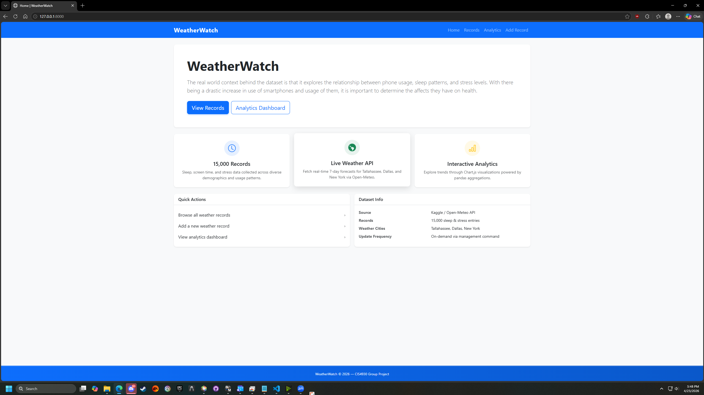
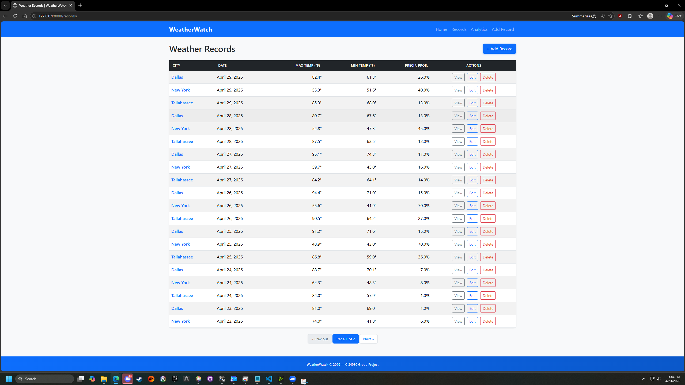
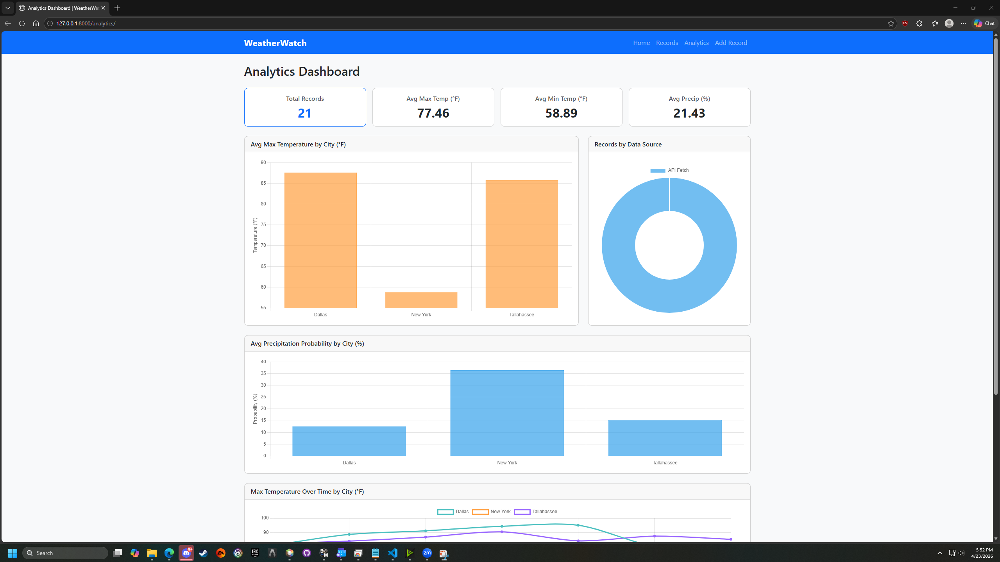

# Sleep, Screen Time, and Stress Analysis — CIS4930 Group 2

## Group Members

| Name | ID |
|------|----|
| Jeremiah Daniels | jbd22a |
| Zachary Bryan | zbb21 |
| Kobus Vansteenburg | kmv21a |
| Ammiel Bowen | ab22dv |

---

## Project Description

This project explores the relationship between smartphone usage, sleep quality, and stress levels using a dataset of 15,000 individual records. Rising smartphone adoption has raised questions about its impact on mental and physical health, and this application lets users browse, filter, and visualize the data to surface those connections. An integrated weather API additionally tracks real-time forecasts for three U.S. cities, demonstrating end-to-end API pipeline integration within the same Django application.

---

## Dataset and API Documentation

| Resource | Link |
|----------|------|
| Primary dataset (Kaggle) | https://www.kaggle.com/datasets/jayjoshi37/sleep-screen-time-and-stress-analysis/data |
| Weather API (Open-Meteo) | https://open-meteo.com/ |

---

## Application Features

| Page | URL | Description |
|------|-----|-------------|
| **Homepage** | `/` | Overview of the project, dataset summary, and navigation links |
| **Records list** | `/records/` | Paginated table of all records (20 per page) |
| **Record detail** | `/records/<id>/` | Full detail view for a single record |
| **Create record** | `/records/add/` | Form to add a new record |
| **Edit record** | `/records/<id>/edit/` | Form to update an existing record |
| **Delete record** | `/records/<id>/delete/` | Confirmation page before deletion |
| **Analytics dashboard** | `/analytics/` | Charts and statistics derived from the dataset |
| **Fetch weather data** | `/fetch/` | Staff-only endpoint that triggers an Open-Meteo API pull |

---

## Setup Instructions

```bash
# 1. Clone the repository
git clone https://github.com/ufl-cis4930/cis4930-sp26-project-group-2.git
cd cis4930-sp26-project-group-2

# 2. Create and activate a virtual environment
python -m venv venv

# On Windows:
venv\Scripts\activate
# On Mac/Linux:
source venv/bin/activate

# 3. Install dependencies
pip install -r requirements.txt

# 4. Navigate to the Django project
cd project-full-stack-web-api/mysite

# 5. Apply migrations
python manage.py migrate

# 6. Seed the database
python manage.py seed_data

# 7. (Optional) Fetch live weather data from the Open-Meteo API
python manage.py fetch_data

# 8. Create an admin account
python manage.py createsuperuser
# You will be prompted to enter a username, email , and password.

# 9. Start the development server
python manage.py runserver
```

Then open http://127.0.0.1:8000/ in your browser.

- Admin panel: http://127.0.0.1:8000/admin/ — log in with the superuser credentials you created above
- The **Fetch Weather Data** button on the analytics page is only visible when logged in as a staff/admin user

---

## Screenshots

### Homepage


### Records List View


### Analytics Dashboard


---

## `manage.py check --deploy` Output

```
System check identified no issues (0 silenced).
```

> Run `python manage.py check --deploy` from inside `project-full-stack-web-api/mysite/` to verify.

---

## Research Questions and Results

**Q1 — Does a trend exist between sleep quality and age?**
A direct correlation does not exist. Plotting average sleep quality score per age produced varying values with no visible trend.

**Q2 — Does a trend exist between screen time and stress levels, and does this change with age?**
A strong positive correlation exists between `daily_screen_time_hours` and `stress_level`, and between `mental_fatigue_score` and `stress_level`. A strong negative correlation exists between `sleep_quality_score` and `stress_level`. These relationships hold across age groups.

**Q3 — How does sleep duration impact stress levels?**
The scatter plot shows widely dispersed data points and a near-flat trend line, indicating little to no strong relationship between sleep duration and stress levels in this dataset.
